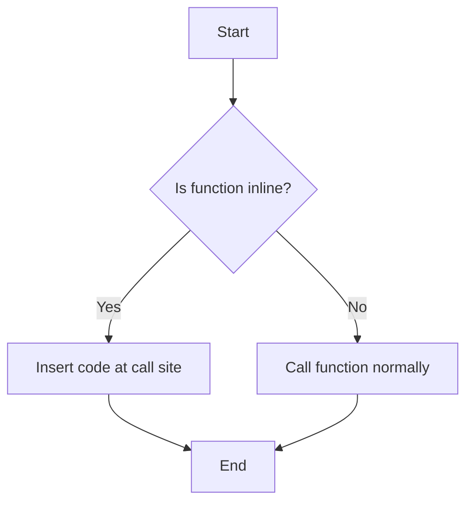
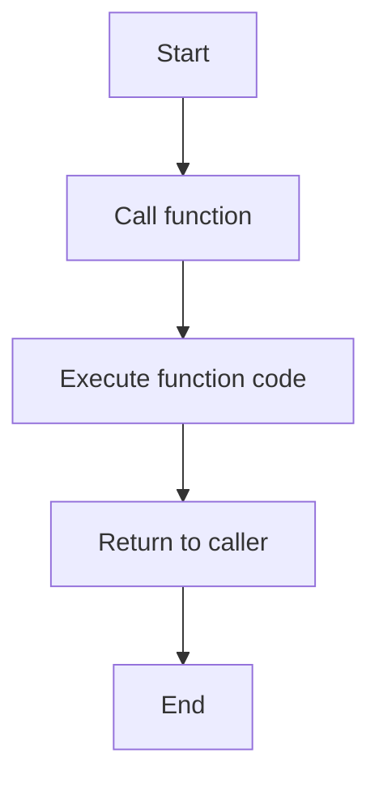

# 📖 Function in C++
> Function in C++, Function is the building block of C++ programs that contains set of statements which are execute when function is called. It can take data as an argument, and perform some task around the data and return some result.

### Table of Contents
- [📖 Function in C++](#-function-in-c)
  - [Table of Contents](#table-of-contents)
  - [🔠 Function Declaration](#🔠-function-declaration)
  - [🤙🏻 Function Call](#🤙🏻-function-call)
  - [🔠 Default Arguments](#🔠-default-arguments)
  - [🔠 Function Overloading](#🔠-function-overloading)
  - [🔄 Inline Function](#🔄-inline-function)
  - [Lambda Function](#lambda-function)
    - [Lambda function with capture](#lambda-function-with-capture)
    - [Return multiple values](#return-multiple-values)

## 🔠 Function Declaration
> A function definition specify the name of the function,what type of value it returns

```cpp
return_type function_name(){
    // Function body
}
```
* `return_type`: Type of value the function returns
* `function_name`: Name assigned to the function
* `Function body`: Set of statements in **curly brackets {}** are executed when the function is called.

## 🤙🏻 Function Call
> Function Call is a way to execute the block of code inside the function by pass there arguments is needed. 
```cpp
void say_name(){
    cout << "Hello world" << endl;
}

say_name(); // calling the function
```

## 🔠 Default Arguments
> Default Arguments is value provided for a parameter in a function that automatically assigned by the compiler if no value is provided.
* **Note**
    1. If default argument is already provided in function declaration, then it should not be provided in function definition.
    2. Default arguments should be provided from right to left. Means you have to declare default argument at the end of the function arguments list.

```cpp
string age(int age = 0){
    return "Your age is " + age;
}

int main(){
    cout << age() << endl; // Your age is 0
    cout << age(21) << endl; // Your age is 21

    return 0;
}
```

## 🔠 Function Overloading
> Function Overloading is a feature in C++ that allows you to create multiple functions with the same name but different parameters. It is used to perform similar operations on different data types or number of arguments.

```cpp
#include <iostream> 

using namespace std;

int add(int a, int b){
    return a + b;
}

float add(float a, float b){
    return a + b;
}

int main(){
    cout << add(5, 10) << endl; // 15
    cout << add(5.5, 10.5) << endl; // 16

    return 0;
}
```
## 🔄 Inline Function
> Inline function can be specified as **inline** to reduce the function call overhead. It is used to define small functions that are called frequently in the program.

> The whole code of the inline function is inserted at the point of call, instead of calling the function. This reduces the overhead of function calls and improves performance.


> **Note**: Inline function is not always inline, it is just a suggestion to the compiler. The compiler may ignore the inline request if it deems necessary. It is **not recommended** to use inline functions for large functions.

### Flowchart of Inline Function



### Flowchart of Normal Function


### Example
```cpp  
#include <iostream>
using namespace std;

inline int add(int a, int b){
    return a + b;
}

int main(){
    int x = 5, y = 10;
    cout << "Sum: " << add(x, y) << endl; // Sum: 15
    return 0;
}
```

## Lambda Function
> Lambda function is an anonymous function that can be defined in a single line. It is used to create small functions without the need to define a separate function. It is also known as **lambda expression**.

> Lambda function is defined using the **[]** operator, followed by the function parameters and the function body.

* **Note**: In lambda function, we does not have to specify the return type, it is automatically deduced by the compiler.

**Example**
```cpp
#include <iostream>
using namespace std;

int main(){
    auto add = [](int a, int b) { return a + b; }; // Lambda function
    cout << "Sum: " << add(5, 10) << endl; // Sum: 15
    return 0;
}
```

### Lambda function with capture
* There are two types of capture in lambda function:
    1. **Capture by value**: Captures a copy of the variable from the outer scope at the time of lambda creation.
        * **Example**
        ```cpp
        #include <iostream>
        using namespace std;

        int main(){
            int x = 5;
            auto add = [x](int a) { return a + x; }; // Capture by value
            cout << "Sum: " << add(10) << endl; // Sum: 15
            cout << "x: " << x << endl; // X: 5
            return 0;
        }
        ```
    2. **Capture by reference**: Captures a reference of the variable from the outer scope at the time of lambda creation. Any changes made to the variable inside the lambda function will affect the original variable.
        * **Example**
        ```cpp
        #include <iostream>
        using namespace std;

        int main(){
            int x = 5;
            int y = 10;
            auto add = [&x](int a) { x = a * x }; // Capture by reference
            add(2); // x = 2 * 5 = 10
            cout << "Sum: " << x << endl; // Sum: 10

            auto add2 = [&x,y](int a){
                x = (a * x) + y; // Capture by reference
                return x;
            };
            cout << "Sum: " << add2(2) << endl; // Sum: 20
            cout << "x: " << x << endl; // x: 20
            return 0;
        }
        ```

### Return multiple values
> To return multiple values from a normal function, we can use **std::tuple**, **std::pair**, **std::array**, **std::vector**, or **struct**.

> To return multiple values from a lambda function, we can use **std::tuple**, **std::pair**, **std::array**, **std::vector**, or **struct**.

* **Example**
    1. Using **std::pair**
    * **Note**: We can return only two values using **std::pair**.
    ```cpp
    #include <iostream>
    #include <utility>
    using namespace std;

    pair<string, int> add(int a, int b) {
        return make_pair("Sum:- ", a + b);
    }

    int main(){
        pair<string, int> result = add(5, 10);

        cout << result.first << result.second << endl; // Sum:- 15
        return 0;
    }
    ```

    2. Using **std::tuple**

    ```cpp
    #include <iostream>
    #include <tuple>
    using namespace std;

    tuple<string, int,int,int,int> add(int a, int b) {
        return make_tuple("Sum:- ", a + b, a-b, a*b, a/b);
    }

    int main(){
        tuple<string, int,int,int,int> result = add(5, 10);

        cout << get<0>(result) << get<1>(result) << endl; // Sum:- 15
        cout << get<2>(result) << endl; // -5
        cout << get<3>(result) << endl; // 50
        cout << get<4>(result) << endl; // 0.5
        return 0;
    }
    ```
