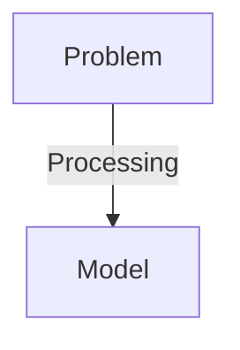

# 👨🏻‍💻 Object Oriented Programming (OOPS) in C++
>
> In Object Oriented Programming we use real world entities such as inheritance, encapsulation, polymorphism to implement the program. The main of `oops` is to bind together the data and function that operate on them so that no other part of the code can access this data except that function.

## Characteristic of OOPS

- [👨🏻‍💻 Object Oriented Programming (OOPS) in C++](#-object-oriented-programming-oops-in-c)
  - [Characteristic of OOPS](#characteristic-of-oops)
  - [Class](#class)
  - [Object](#object)
  - [Encapsulation](#encapsulation)
  - [Abstraction](#abstraction)
  - [Polymorphism](#polymorphism)
    - [1. Compile Time Polymorphism](#1-compile-time-polymorphism)
    - [2. Run Time Polymorphism](#2-run-time-polymorphism)
    - [Virtual Function](#virtual-function)
      - [Function Overriding](#function-overriding)
  - [Inheritance](#inheritance)
    - [1. Single Inheritance](#1-single-inheritance)
  - [Constructor](#constructor)
    - [1. Default Constructor](#1-default-constructor)
    - [2. Parameter Constructor](#2-parameter-constructor)
    - [3. Copy Constructor](#3-copy-constructor)
      - [**Need of user defined copy constructor**](#need-of-user-defined-copy-constructor)
  - [`destructors`](#destructors)
    - [`private destructor`](#private-destructor)
  - [`this`](#this)
  - [Local and Nested Classes](#local-and-nested-classes)


## Class

> Classes are the building block of Object Oriented Programming language they are used to build the blueprint representing group of object. It is a `used-defined` data type which share common properties (`data`) and behavior (`member function`). And we are able to change there [access modifier](#encapsulation).

```cpp
#include <iostream>
using namespace std;

class Student {
    // data
   public:
    string name;
    int age;
    int roll_no;
    float cgpa;

    // member functions
    void getStudentInfo() {
        cout << "Name " << name << endl;
        cout << "Age " << age << endl;
        cout << "Roll No " << roll_no << endl;
        cout << "CGPA " << cgpa << endl;
    }
};

int main() {
    Student s1;

    s1.name = "Abdur Rab Khan";
    s1.age = 21;
    s1.roll_no = 32;
    s1.cgpa = 8.70;

    s1.getStudentInfo();

    return 0;
}
```

## Object

> Objects are instances of a class that allow us to access and utilize the characteristics and behaviors defined in the class. While a class is just a blueprint or concept, an object is the actual entity created from that blueprint. In C++, we cannot use the properties (data members) or behaviors (member functions) defined in a class unless we create an object of that class.

  When class is defined there is no memory allocated but when it is (initialized) than memory is allocated.

```cpp
// Example of creating objects
int main() {
    // Creating two different objects of Student class
    Student s1;  // First object
    Student s2;  // Second object
    
    // Initializing first object
    s1.name = "Abdur Rab Khan";
    s1.age = 21;
    
    // Initializing second object
    s2.name = "John Doe";
    s2.age = 20;
    
    // Now we can use member functions through these objects
    s1.getStudentInfo();
    s2.getStudentInfo();
    
    return 0;
}
```

## Encapsulation
>
> Encapsulation is a concept in object-oriented programming that refers to wrapping data and related functions into a single unit, usually a class. In C++, we achieve encapsulation using access modifiers such as `private`, `public`, and `protected`. These modifiers help protect the internal state of an object by preventing unauthorized access or modification from outside the class.


- ### Access Modifier
  >
    > In C++, access modifiers allow a class to control the visibility of its members. This helps restrict direct access from outside the class, a concept known as data hiding.
  - Types of **access modifier.**
        1. [`public`](#1-public)
        2. [`private`](#2-private)
        3. [`protected`](#3-protected)

    #### 1. `public`

    > In C++, `public` access modifier allows class members to  be accessed from outside the class.

  - **Examples**

    ```cpp
    #include<iostream>
    using namespace std;

    class A{
        int num1 = 10;
        int num2 = 10;
    
        public:
        int getSum(){
            return num1 + num2;
        }
    }

    int main(){
        A a1;
    
        cout << "Sum of num1 and num2 " << s1.getSum() << endl; // 20
    
        cout << a1.num1 << endl; // ⚠️ We can't access it because it is private
        cout << a1.num2 << endl;
        return 0;
    }
    ```

    #### 2. `private`

    > In C++, `private` access modifier restricts class members to be accessed from outside the class. It also restricts from subclass also. The makes protected a good choice when we want to hide some critical(related to security or credential) information.

  - **Example**

    ```cpp
    // See Public Example
    ```

    #### 3. `protected`

       > In C++, `protected` access modifiers are different from `private` and `public`. It restricts access class members from outside the class but allows access from subclass. This makes protected a good choice when we want to allow derived classes to access certain members, while still keeping them hidden from the outside world. Unlike private members, which are completely inaccessible outside the class, protected members are available to any class that inherits from the base class.

    - **Example**

       ```cpp
        #include <iostream>
        using namespace std;
        
        class A {
        protected:
            string password;
        
        public:
            void setPassword(string pass) { password = pass; }
        };
        
        class B : public A {
            string name = "Abdur Rab Khan";
            int age = 21;
        
            bool isCorrectPass() {
                string pass;
                cout << "Enter pass ";
                getline(cin, pass);
        
                return password == pass;
            }
        
        public:
        
            void printMyInfo() {
                bool isCorrect = isCorrectPass();
        
                if (isCorrect) {
                    cout << "Name " << name << endl;
                    cout << "Age " << age << endl;
                } else {
                    cout << "Password is incorrect" << endl;
                }
            }
        };
        
        int main() {
            B p1;
        
            p1.setPassword("abdurrab123");
        
            // cout << p1.password; ⚠️ We can't access it.
        
            p1.printMyInfo();
            return 0;
        }
       ```

## Abstraction

> Abstraction in C++ refers to hiding complex mechanisms and exposing only the essential features to the outside world. we can implement using `access modifier`.
For example, when a person drives a car and presses the accelerator, they do not need to understand the internal mechanisms that increase the speed.  

- Types of abstraction
    1. **Data Abstraction**: Show only required information about the data.
    2. **Control Abstraction**: Show only required information about the implementation.



- **Example**

    ```cpp
    #include<iostream>
    using namespace std;
    
    class Vehicle
    {
    private:
            void piston()
            {
                cout<<"4 piston\n";
            }
    
            void manWhoMade()
            {
                cout<<"Markus Librette\n";
            }
        public:
            void company()
            {
                cout<<"GFG\n";
            }
            void model()
            {
                cout<<"SIMPLE\n";
            }
            void color()
            {
                cout<<"Red/GREEN/Silver\n";
            }
            void cost()
            {
                cout<<"Rs. 60000 to 900000\n";
            }
            void oil()
            {
                cout<<"PETROL\n";
            }
        };
    
    int main()
    {
        
        Vehicle obj;
        obj.company();
        obj.model();
        obj.color();
        obj.cost();
        obj.oil();
    }
    ```

## Polymorphism
>
> The term **polymorphism** means having many forms. In C++ polymorphism is concept that can be applied on `function` and `operator`. A single function can work differently in different situations. similarly `operator` can work differently when used in different context.

- Types of **Polymorphism**
    1. [Compile time **Polymorphism**](#1-compile-time-polymorphism)
    2. [Run time **Polymorphism**](#2-run-time-polymorphism)

    ```mermaid
    flowchart TD
    
    A[**Polymorphism**] --> B[Compile Time]
    A --> C[Run time]
    B --> E[Function Overloading]
    B --> F[Function Overriding]
    C --> G[Virtual Function]
    ```

  ### 1. Compile Time Polymorphism
  >
    > In Compiler time polymorphism compiler can determine how the function or operator will work depending on the context. This type of polymorphism is achieved by function overloading or operator overloading. It is also know as **early binding**.

    1. **Function Overloading**
        > Function Overloading is a feature in `OOPS`. Such function can work differently for different parameter. Function can be overload by changing number of `argument` or type of `argument`.

        ```cpp
        #include<iostream>
        using namespace std;

        class Math{
            public:
            
            // Work we call like this Math.add(1,2)
            int add(int a,int b){
                return a + b;
            }

            // Work we call like this Math.add(1,2,3)
            int add(int a, int b, int c){
                return a + b + c;
            }

            // Work we call like this Math.add(1.5,2.6)
            int add(float a, float b){
                return a + b;
            }

            // Work we call like this Math.add(1.5,1.5,1.5)
            int add(float a, float b, float c){
                return a + b + b;
            }
        }
        ```

    2. **Operator Overloading**
        > Operator Overloading in C++ is special meaning for particular data type, We can change the working mechanism of Operator based upon context.

        ```cpp
            #include <iostream>
            using namespace std;
            
            class Complex {
            public:
                int real, imag;
                
                Complex(int r, int i) :
                real(r), imag(i) {}
            
                // Overloading the '+' operator
                Complex operator+(const Complex& obj) {
                    return Complex(real + obj.real,
                    imag + obj.imag);
                }
            };
            
            int main() {
                Complex c1(10, 5), c2(2, 4);
                
                // Adding c1 and c2 using + operator
                Complex c3 = c1 + c2;  
                cout << c3.real << " + i" << c3.imag;
                return 0;
            }
        ```

  ### 2. Run Time Polymorphism
  >
    > Run Time Polymorphism is known as **late binding** and **dynamic polymorphism**. The function in run time polymorphism is resolved at runtime where the compiler determine which function is call to bind at completion. Run time polymorphism is implement using function overriding with virtual function.

  ### Virtual Function

    > A **Virtual Function** is a type of function that we declared in a base using **`virtual`** and expect it to be ***overridden*** in the derived class. It tell compiler to perform `late binding` means compiler will decide in runtime to call right function.
  - **Example**

    ```cpp
    #include<iostream>
    using namespace std;

    class A{
        protected:
        int a;
        int b;

        public:
        A(int a, int b){
            this->a = a;
            this->b = b;
        }

        virtual void show(){
            cout << "Base Class \n";
            cout << "A " << a << " B " << b << endl;
        }
    }

    class B: public A{
            public:
        B(int x, int y): A(x,y) {}

        void show() override {
            cout << "Derived Class \n";
            cout << "A " << a << " B " << b << endl;
        }
    }

    int main(){
        A* ptr = new B(5,5);

        ptr->show(); 
        // ✅ Print Derived Class Show Method 
        // ⚠️ If we does not use virtual then compiler automatically call Base Class Show Method.
        return 0;
    }
    ```

  - If you use **Pointer** or **Reference** to the base class to call the function, C++ will choose the function of the actual object at runtime. **NOT** based on the type of the pointer/reference. **`If you use virtual function`**

  - **Application**
        1. Imagine you are writing a big system, and you have a set of classes that share the same interface (base class), but each one behaves differently.
        2. If you want correct behavior at runtime depending on the real object (not the pointer/reference type), you need virtual functions.
        3. **Example** Like you have Payment Class and having two way to pay via debit card or credit card and having multiple payment providers.

    - **Example**

        ```cpp
        #include <iostream>
        #include <cstdlib>  // for rand()
        #include <ctime>    // for time()
        using namespace std;
        
        // Base class
        class Payment {
        public:
            virtual void pay(float amount) = 0;    // Pure virtual function
            virtual void refund(float amount) = 0; // Pure virtual function
            virtual ~Payment() {}                  // Virtual destructor (good habit)
        };
        
        // Derived classes
        class CreditCardPayment : public Payment {
        public:
            void pay(float amount) override {
                cout << "[CreditCard] Paid $" << amount << endl;
            }
            
            void refund(float amount) override {
                cout << "[CreditCard] Refunded $" << amount << endl;
            }
        };
        
        class PayPalPayment : public Payment {
        public:
            void pay(float amount) override {
                cout << "[PayPal] Paid $" << amount << endl;
            }
            
            void refund(float amount) override {
                cout << "[PayPal] Refunded $" << amount << endl;
            }
        };
        
        class UPIPayment : public Payment {
        public:
            void pay(float amount) override {
                cout << "[UPI] Paid $" << amount << endl;
            }
            
            void refund(float amount) override {
                cout << "[UPI] Refunded $" << amount << endl;
            }
        };
        
        // Process any payment
        void processPayment(Payment* payment, float amount) {
            payment->pay(amount);
            payment->refund(amount * 0.25); // Refund 25% as example
        }
        
        int main() {
            srand(time(0)); // Seed random
        
            Payment* payments[10];
        
            // Randomly create 10 payments
            for (int i = 0; i < 10; ++i) {
                int randomType = rand() % 3;  // 0, 1, or 2
        
                if (randomType == 0)
                    payments[i] = new CreditCardPayment();
                else if (randomType == 1)
                    payments[i] = new PayPalPayment();
                else
                    payments[i] = new UPIPayment();
            }
        
            // Process all payments
            for (int i = 0; i < 10; ++i) {
                cout << "Transaction " << (i+1) << ": ";
                processPayment(payments[i], (i+1)*100); // Amount increases
            }

            // Free memory
            for (int i = 0; i < 10; ++i) {
                delete payments[i];
            }
        
            return 0;
        }
        ```

  - How works behind the scenes
    - When you declare at least one virtual function.
            1. The compiler create `vtable` (Virtual Table).
            2. The vtable is an array of function pointers.
            3. Each class with virtual function has its own `vtable`.
            4. Every object of such a class has a hidden pointer inside it (called vptr) pointing to its class’s vtable.
    - When you cal a virtual function.
      - `Base* bptr = new Derived();`

          ```mermaid
          flowchart TD
          A[Base* ptr] --> | point to | B[Derived object]
          B --> | contains | C[vptr]
          C --> | points to | D[Derived's vtable]
          D --> | has pointer to | E["Derived::show()"]

          F["ptr->show() call"] --> G[uses vtpr]
          G --> H[looks up Derived's vtable]
          H --> I[class Derived::show]
          ```

  #### Function Overriding
  >
    > Function Overriding happen when a derived class define one or more function of the base class. The base class function will be overridden. The base class function must be declared as virtual function for runtime polymorphism to happen.

    ```cpp
    #include<iostream>
    using namespace std;

    class Base{
        public:
        virtual void display(){
            cout << "Base Class function" << endl;
        }
    }

    class derived: public Base{
        public:
        void display() override {
            cout << "Derived Class function << endl;
        }
    }

    int main(){
        // Creating a pointer of type Base
        Base* basePtr;
 
        // Creating an object of Derived class
        Derived derivedObj;
    
        // Pointing base class pointer to derived class object
        basePtr = &derivedObj;
        
        // Calling the display function using base class pointer. bcz we use virtual function that's why derived class display fun will call.
        basePtr->display();
        return 0;
    }
    ```

  - **Example**

    ```mermaid
    graph TD
        A["Object (basePtr)"] --> B[vptr]
        B --> C[vtable]
        C --> D["[0]: address of display()"]
        C --> E["[1]: address of another virtual function"]
        C --> F[etc.]
    ```

## Inheritance
>
> A Class that have capabilities to derive the characteristic and properties from another class is called **inheritance**. Inheritance is one of the important concept in OOPS.

- Types of Inheritance
    1. Single Inheritance
    2. Multilevel Inheritance
    3. Multiple Inheritance
    4. Hierarchal Inheritance
    5. Hybrid Inheritance

- **Sub Class**: The class that inherits properties from another class.
- **Super Class or Base Class**: The class whose properties are inherited by a sub class.

- **Example of inheritance**

    ```cpp
    #include <iostream>
    using namespace std;
    
    // Base class that is to be inherited
    class Parent {
    public:
        int id_p;
        Parent(int x = 22) : id_p(x) {}
        void printID_p() { cout << "Base ID: " << id_p << endl; }
    };
    
    // Derived publicly inheriting from Base
    // Class
    class Child : public Parent {
    public:
        int id_c;
        Child(int x = 22) : id_c(x) {}
        void printID_c() { cout << "Child ID: " << id_c << endl; }
    };
    
    int main() {
        Child obj1;
    
        // An object of class child has all data members
        // and member functions of class parent
        // so we try accessing the parents method and data from
        // the child class object.
        obj1.id_p = 7;
        obj1.printID_p();
    
        // finally accessing the child class methods and data
        // too
        obj1.id_c = 91;
        obj1.printID_c();
        return 0;
    }
    
    ```

  ### 1. Single Inheritance

    > In Single Inheritance, a class is inherit one class. i.e on class is inherited by one derived class only.

    ```mermaid
    flowchart TD
    
    A["Class Parent (base class)"] --> B["Child Class (derived class)"]
    
    ```

  - **Example**

    ```cpp
    #include <iostream>
    using namespace std;
    
    class Vehicle {
    public:
        Vehicle() {
            cout << "This is a Vehicle"<< endl;
        }
    };
    
    // Sub class derived from a single base classes
    class Car : public Vehicle {
    public:
        Car() {
            cout << "This Vehicle is Car"<< endl;
        }
    };
    
    int main() {
        
        // Creating object of sub class will
        // invoke the constructor of base classes
        Car obj;
        return 0;
    }
    ```

    ### 2. Multilevel Inheritance

    > In multilevel Inheritance, A Derived class is created from another derived class and that derived class can be derived from base class.

    ```mermaid
    flowchart TD
        A["Class GrandParent (base class)"] --> B["Class Parent (derived class)"] --> C["Class Son (derived class)"]
    ```

    ```cpp
    #include <iostream>
    using namespace std;
    
    class Vehicle {
    public:
        Vehicle() {
            cout << "This is a Vehicle"<< endl;
        }
    };
    
    class fourWheeler : public Vehicle {
    public:
        fourWheeler() {
            cout << "4 Wheeler Vehicles"<< endl;
        }
    };
    
    class Car : public fourWheeler {
    public:
        Car() {
            cout << "This 4 Wheeler Vehical is a Car";
        }
    };
    
    int main() {
        
        // Creating object of sub class will
        // invoke the constructor of base classes.
        Car obj;
        return 0;
    }
    ```

    ### 3. Multiple Inheritance

    > In multiple Inheritance, derived class are inherited by from a single base class.

    ```mermaid
    flowchart TD   
    A["Class Parent (base class)"]
    A --> B["Class Child1 (derived class)"]
    A --> C["Class Child2 (derived class)"]
    A --> D["Class Child3 (derived class)"]
    ```

  - **Example**

    ```cpp
    #include <iostream>
    using namespace std;
    
    class LandVehicle {
    public:
        LandVehicle() {
            cout << "This is a LandVehicle"<< endl;
        }
    };
    
    class WaterVehicle {
    public:
        WaterVehicle() {
            cout << "This is a WaterVehicle"<< endl;
        }
    };
    
    // sub class derived from two base classes
    class AmphibiousVehicle : public WaterVehicle, public LandVehicle {
    public:
        AmphibiousVehicle() {
            cout << "This is an AmphibiousVehicle"<< endl;
        }
    };
    
    int main() {
        
        // Creating object of sub class will
        // invoke the constructor of base classes.
        AmphibiousVehicle obj;
        return 0;
    }
    ```

## Constructor

> **Constructor** is a special method that is invoked automatically at the time of object of the class is created. It is commonly used to initialize the data members of the class. **Constructor** in C++ has the same name as the class or structure.

- There are three **types** of constructor:
  1. [Default Constructor](#1-default-constructor)
  2. [Parameter Constructor](#2-parameter-constructor)
  3. [Copy Constructor](#3-copy-constructor)
  4. [Parameter Constructor](#4-private-constructor)
  5. [Move Constructor](#5-move-constructor)

- **Example**

  ```cpp
  #include<iostream>
  using namespace std;

  class A{
    int a;

    A(int a){
        this->a = a;
        cout << "Constructor is called " << endl;
    }
  }

  int main(){
    A a1(55);

    return 0;
  }
  ```

  - **Output**

    ```shell
    Constructor is called
    ```

### 1. Default Constructor

> A default constructor is a type of constructor that take **no arguments** or has default value to all **arguments**. It is also referred as **zero-arguments constructor**.
If we do not explicitly define constructor, compiler **automatically define** a  constructor during compilation. However when programmer explicitly define constructor, the compiler does not generate it.

- In cases where a class is derived from a base class that has a default constructor, or a class contains a member object of another class with a default constructor, the compiler automatically generates a constructor for the derived or containing class. In this generated constructor, the compiler implicitly inserts calls to the base class constructor and member object constructors before executing the body of the derived or containing class's constructor.

- **Default constructor and inheritance**

    ```cpp
    #include <iostream>
    using namespace std;
    
    class Base {
    public:
        Base() { cout << "Base Class Constructor is called " << endl; }
        int size;
    };
    
    class Derived : public Base {
    public:
        Derived() {
            cout << "Derived Class Constructor is called " << endl;
            Base::size = 55;
        }
    };
    
    class A : public Base {
        //  Compiler define a default constructor of Base.
        // and inserts stub to call A constructor
        // Compiler won't be initialize any data on Base Class
    };
    
    class B : public Base {
    public:
        B() {  // User defined default constructor of B
            // Compiler insert stub to call Base's constructor
            cout << "B constructor " << endl;
            // Compiler won't be initialize any data of Base
        }
    };
    
    int main() {
        Derived d1;
        A a1;
        B b1;
    
        cout << d1.size << endl;
        return 0;
    }
    ```

### 2. Parameter Constructor

> In Parameter constructor we define parameter on the constructors

- **Example**

  ```cpp
  #include<iostream>
  using namespace std;

  class A{
    public:
    A(int x, int y = 0){
        cout << "The sum of x and y is " << x + y << endl;
    }
  }

  int main(){
    A a1(5);
    A a2(20,2);

    return 0;
  }
  ```

### 3. Copy Constructor

> A copy constructor is a type of **special constructor** in C++, that is called when new object is created using existing object of the same class. If no copy constructor is explicitly defined, the compiler automatically generates one.
> This process is known as **copy initialization**.and the compiler-performed default version is often referred to as member-wise initialization, because it copies each data member of the source object into the new object, one by one.

- **Example**
  
  ```cpp
  #include <iostream>
    using namespace std;
    
    class A {
    public:
        int num;
    };
    
    int main() {
        A a1;
        a1.num = 55;
        cout << "The value of a1's num is " << a1.num << endl;
    
        // Creating another object using a1
        // Copy constructor calling
        A a2(a1);
        cout << "The value of a2's num is " << a1.num << endl;
        return 0;
    }
  ```

  - **Output**

    ```shell
    The value of a1 is 55
    The value of a2 is 55
    ```

    - It is above example we haven't define any copy constructor here, how can we able to create new object using existing one.
    - So by default C++ compiler create sample copy constructor when it is not explicitly defined by the programmer.
    - It is called **implicit copy constructor**. and it will copy the base and member of an object in the same order as they were they present in the class.

  - **Creating User define copy constructor**
    - Copy constructor take an argument where take reference of an object of the same class.

    - **Syntax to create copy constructor**

      ```cpp
      className (const ClassName &obj){
        // Copy logic
      }
      ```

      - Here, the **const** qualifies is optional, to prevent from modification we have to use it.
  
  #### **Need of user defined copy constructor**

    > If we don't define our own copy constructor. the C++ compiler **automatically** define copy constructor which generally works fine. but problem happen when working with **pointers**, **run time allocation** of a resource like a **file handling**, **network connection** etc. because default copy constructor does only shallow copy.

  - **Example**

    ```cpp
    #include<iostream>

    using namespace std;

    class A{
        int x;

        // Constructor
        A(){}

        // Copy Constructor
        A(const A &obj){
            x = obj.x;

            cout << "Calling copy constructor" << endl;
        }
    }

    int main(){
        A obj1;
        a.x = 55;
        cout << "The obj1's x is << obj1.x << endl; // 55

        A obj2(obj1);
        cout << "The obj2's x is" << obj2.x << endl; // 55
        return 0;
    }
    ```

    - In the above example, we create an object called `obj1` and another object called `obj2` with the help of `obj1`.
    - when we pass object into the constructor `copy_constructor` will call and initialize value using passed object(`obj1`).
    - What if?? We pass pointer into the constructor. And assign pointer into the data member instead of assign value. it but i can cause really **fricking problem**. So what happen if we delete that object than it can cause [dangling pointer](../09_pointers/pointers.md/#3-dangling).

  - **There are two types of copy**
      1. **Shallow copy**
      2. **Deep copy**

   1. **Shallow copy**
      - **Shallow copy** means if we pass pointer of an resource, then that pointer will copy not actual resource. That can lead [dangling pointer](../09_pointers/pointers.md/#3-dangling) if actual object is deleted.

        

      - **Example**

        ```cpp
        #include <iostream>
        using namespace std;


        class B {
        public:
            int* num;
        
            //    Creating Constructor and assign the value of it.
            B(int* val) { num = val; }
        
            // Creating copy constructor and assign the value from obj.
            B(const B& obj) { num = obj.num; }

            // Cleaning data members after using it.
            ~B() { delete num; }
        };
        
        int main() {
            // Dynamic Allocation of an object.
            int* num = new int(55);
        
            B* obj1 = new B(num);
            cout << "Obj1's num is " << *(obj1->num) << endl;
        
            // Using copy constructor
            B obj2(*obj1);
        
            cout << "obj'2 num is " << *(obj2.num) << endl;

            cout << "Printing Address " << endl;
            cout << "Address of obj'1 num is " << obj1->num << endl;
            cout << "Address of obj'2 num is " << obj2.num << endl;
        
            delete obj1;
        
            cout << "obj'2 num is " << *(obj2.num) << endl;
            return 0;
        }
        ```

        - **Output**

          ```shell
          Obj1's num is 55
          obj'2 num is 55
          Printing Address 
          Address of obj'1 num is 0x14f6d3ff840
          Address of obj'2 num is 0x14f6d3ff840
          obj'2 num is -382575824 # Invalid data!! because we delete the main object. that obj2 refer that memory the first object member not data.
          ```

   2. **Deep copy**
       - In user defined copy constructor, we have to make sure that **pointers** (or **reference**) of a copied object point to new copy of the **dynamic resource allocated** manually in copy constructor using new operators.

            

       - **Example**

            ```cpp
            #include <cstring>
            #include <iostream>
            
            using namespace std;
            
            class String {
                char* str;
            
            public:
                // Constructor
                String(const char* s = NULL);
            
                // Destructor to clean it.
                ~String() { delete[] str; }
            
                // Copy Constructor
                String(const String&);
            
                // Print method
                void print() { cout << str << endl; }
            
                // Change value
                void change(const char*);
            };
                    
            String::String(const char* s) {
                int size = strlen(s) + 1;
            
                str = new char[size];
                strcpy(str, s);
            }
            
            String::String(const String& old_str) {
                int size = strlen(old_str.str);
            
                str = new char[size + 1];
                strcpy(str, old_str.str);
            }
                    
            void String::change(const char* s) {
                delete[] str;
            
                int size = strlen(s) + 1;
                str = new char[size];
                strcpy(str, s);
            }
                
            int main() {
                String str1("Abdur Rab");
            
                String str2 = str1;
            
                str2.print();
                str1.print();
            
                str2.change("Abdur Rab Khan");
            
                str1.print();
                str2.print();
            
                return 0;
            } 
            ```

            - **Output**

                ```shell
                Abdur Rab
                Abdur Rab
                Abdur Rab
                Abdur Rab Khan
                ```

            - In the above `example`, if we remove `copy_constructor` the output of `str1` and `str2` will be same after changing. because default `copy_constructor` from compiler when passing pointer it directly set the pointer not resource that way.

## `destructors`

> **Destructors** is the instance of member function that automatically call when object is going to destroy. It is the last function that is going to called before object is destroyed.

- **Syntax**

```cpp
~className(){
    // Body of destructor
}
```

- We can also define destructor out of the class just like other member functions.

    ```cpp
    #include<iostream>
    
    using namespace std;
    
    class A{
        public:
    
        ~className(){}
    }
    
    A::~className(){
        // Body of destructor
    }
    ```

- **Example**

  - Just like [constructor](#constructor) call at the time of object created, same [destructor](#destructors) call when object is going to destroyed.

    ```cpp
    #include<iostream>
    
    using namespace std;
    
    class Test{
        public:
        
        // Constructor is created
        Test(){
            cout << "Constructor is called" << endl;
        }
    
        // Destructor is created
        ~Test(){
            cout << "Destructor is called" << endl;
        }
    };
    
    int main(){
        Test t1;
    
        return 0;
    }
    ```

  - **Output**

    ```shell
    Constructor is called
    Destructor is called 
    ```

- **Need of user defined destructor**

  - Just like when we do not define constructor. the compiler created default constructor automatically. Same mechanism is also for destructor. but problem happen in **dynamic memory allocation** We know that it does not delete unless we delete using `delete` keyword.
  
  - **Example**

    ```cpp
    #include<iostream>
    
    class A{
        int* num;

        public:
        A(int value){
            num = new int(value);
        }

        ~A(){
            cout << "Destructor is called " << endl;
            delete num;
        }
    }

    using namespace std;

    int main(){
        A a1(55);

        return 0;
    }
    ```

    - **Output**

        ```shell
        a1's num is 55
        Destructor is called
        After deleting
        a1's num is -1021378128
        ```

### `private destructor`


## `this`

## Local and Nested Classes
