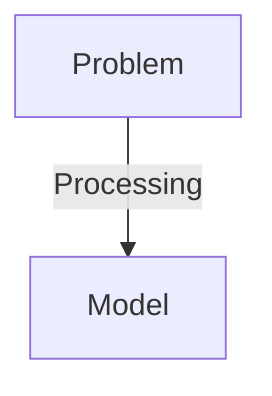
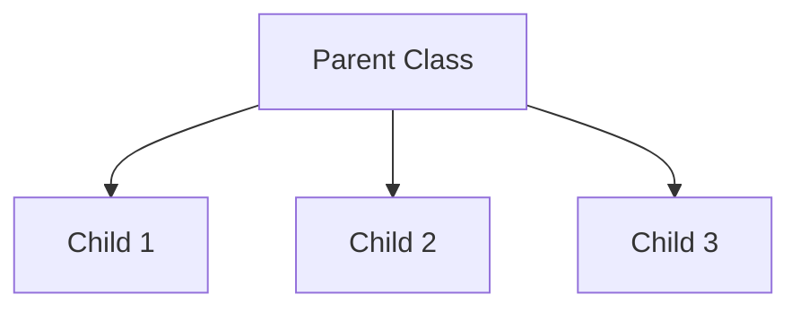

# 👨🏻‍💻 Object Oriented Programming (OOPS) in C++
> In Object Oriented Programming we use real world entities such as inheritance, encapsulation, polymorphism to implement the program. The main of `oops` is to bind together the data and function that operate on them so that no other part of the code can access this data except that function.


## Characteristic of OOPS
- [👨🏻‍💻 Object Oriented Programming (OOPS) in C++](#-object-oriented-programming-oops-in-c)
  - [Characteristic of OOPS](#characteristic-of-oops)
  - [Class](#class)
  - [Object](#object)
  - [Encapsulation](#encapsulation)
  - [Abstraction](#abstraction)
  - [Polymorphism](#polymorphism)
  - [Inheritance](#inheritance)
  


## Class
> Classes are the building block of Object Oriented Programming language they are used to build the blueprint representing group of object. It is a `used-defined` data type which share common properties (`data`) and behavior (`member function`). And we are able to change there [access modifier](#encapsulation).

```cpp
#include <iostream>
using namespace std;

class Student {
    // data
   public:
    string name;
    int age;
    int roll_no;
    float cgpa;

    // member functions
    void getStudentInfo() {
        cout << "Name " << name << endl;
        cout << "Age " << age << endl;
        cout << "Roll No " << roll_no << endl;
        cout << "CGPA " << cgpa << endl;
    }
};

int main() {
    Student s1;

    s1.name = "Abdur Rab Khan";
    s1.age = 21;
    s1.roll_no = 32;
    s1.cgpa = 8.70;

    s1.getStudentInfo();

    return 0;
}
```

## Object
> Objects are instances of a class that allow us to access and utilize the characteristics and behaviors defined in the class. While a class is just a blueprint or concept, an object is the actual entity created from that blueprint. In C++, we cannot use the properties (data members) or behaviors (member functions) defined in a class unless we create an object of that class.

  When class is defined there is no memory allocated but when it is (initialized) than memory is allocated.

```cpp
// Example of creating objects
int main() {
    // Creating two different objects of Student class
    Student s1;  // First object
    Student s2;  // Second object
    
    // Initializing first object
    s1.name = "Abdur Rab Khan";
    s1.age = 21;
    
    // Initializing second object
    s2.name = "John Doe";
    s2.age = 20;
    
    // Now we can use member functions through these objects
    s1.getStudentInfo();
    s2.getStudentInfo();
    
    return 0;
}
```
## Encapsulation
> Encapsulation is a concept in object-oriented programming that refers to wrapping data and related functions into a single unit, usually a class. In C++, we achieve encapsulation using access modifiers such as `private`, `public`, and `protected`. These modifiers help protect the internal state of an object by preventing unauthorized access or modification from outside the class.


* ### Access Modifier
    > In C++, access modifiers allow a class to control the visibility of its members. This helps restrict direct access from outside the class, a concept known as data hiding.
    * Types of **access modifier.**
        1. [`public`](#public)
        2. [`private`](#private)
        3. [`protected`](#protected)

    1. #### `public`
        > In C++, `public` access modifier allows class members to  be accessed from outside the class.

        ```cpp
        #include<iostream>
        using namespace std;

        class A{
            int num1 = 10;
            int num2 = 10;

            public:
            int getSum(){
                return num1 + num2;
            }
        }

        int main(){
            A a1;

            cout << "Sum of num1 and num2 " << s1.getSum() << endl; // 20

            cout << a1.num1 << endl; // ⚠️ We can't access it because it is private
            cout << a1.num2 << endl;
            return 0;
        }
        ```

    2. #### `private`
        > In C++, `private` access modifier restricts class members to be accessed from outside the class. It also restricts from subclass also. The makes protected a good choice when we want to hide some critical(related to security or credential) information.

        ```cpp
        // See Public Example
        ```
    3. #### `protected`
       > In C++, `protected` access modifiers are different from `private` and `public`. It restricts access class members from outside the class but allows access from subclass. This makes protected a good choice when we want to allow derived classes to access certain members, while still keeping them hidden from the outside world. Unlike private members, which are completely inaccessible outside the class, protected members are available to any class that inherits from the base class. 
       ```cpp
        #include <iostream>
        using namespace std;
        
        class A {
        protected:
            string password;
        
        public:
            void setPassword(string pass) { password = pass; }
        };
        
        class B : public A {
            string name = "Abdur Rab Khan";
            int age = 21;
        
            bool isCorrectPass() {
                string pass;
                cout << "Enter pass ";
                getline(cin, pass);
        
                return password == pass;
            }
        
        public:
        
            void printMyInfo() {
                bool isCorrect = isCorrectPass();
        
                if (isCorrect) {
                    cout << "Name " << name << endl;
                    cout << "Age " << age << endl;
                } else {
                    cout << "Password is incorrect" << endl;
                }
            }
        };
        
        int main() {
            B p1;
        
            p1.setPassword("abdurrab123");
        
            // cout << p1.password; ⚠️ We can't access it.
        
            p1.printMyInfo();
            return 0;
        }
       ```
## Abstraction
>Abstraction in C++ refers to hiding complex mechanisms and exposing only the essential features to the outside world. we can implement using `access modifier`.
For example, when a person drives a car and presses the accelerator, they do not need to understand the internal mechanisms that increase the speed.  

* Types of abstraction
    1. **Data Abstraction**: Show only required information about the data.
    2. **Control Abstraction**: Show only required information about the implementation.



```cpp
#include<iostream>
using namespace std;

class Vehicle
{
  private:
          void piston()
        {
            cout<<"4 piston\n";
        }

        void manWhoMade()
        {
            cout<<"Markus Librette\n";
        }
    public:
        void company()
        {
            cout<<"GFG\n";
        }
        void model()
        {
            cout<<"SIMPLE\n";
        }
        void color()
        {
            cout<<"Red/GREEN/Silver\n";
        }
        void cost()
        {
            cout<<"Rs. 60000 to 900000\n";
        }
        void oil()
        {
            cout<<"PETROL\n";
        }
};
int main()
{
    
    Vehicle obj;
    obj.company();
    obj.model();
    obj.color();
    obj.cost();
    obj.oil();
}
```

## Polymorphism
> The term **polymorphism** means having many forms. In C++ polymorphism is concept that can be applied on `function` and `operator`. A single function can work differently in different situations. similarly `operator` can work differently when used in different context.

* Types of **Polymorphism**
    1. [Compile time **Polymorphism**](#1-compile-time-polymorphism)
    2. [Run time **Polymorphism**](#2-run-time-polymorphism)
    
    ```mermaid
    flowchart TD
    
    A[**Polymorphism**] --> B[Compile Time]
    A --> C[Run time]
    B --> E[Function Overloading]
    B --> F[Function Overriding]
    C --> G[Virtual Function]
    ```
    
    ### 1. Compile Time Polymorphism
    > In Compiler time polymorphism compiler can determine how the function or operator will work depending on the context. This type of polymorphism is achieved by function overloading or operator overloading. It is also know as **early binding**.
 
    1. **Function Overloading**
        > Function Overloading is a feature in `OOPS`. Such function can work differently for different parameter. Function can be overload by changing number of `argument` or type of `argument`.
        ```cpp
        #include<iostream>
        using namespace std;

        class Math{
            public:
            
            // Work we call like this Math.add(1,2)
            int add(int a,int b){
                return a + b;
            }

            // Work we call like this Math.add(1,2,3)
            int add(int a, int b, int c){
                return a + b + c;
            }

            // Work we call like this Math.add(1.5,2.6)
            int add(float a, float b){
                return a + b;
            }

            // Work we call like this Math.add(1.5,1.5,1.5)
            int add(float a, float b, float c){
                return a + b + b;
            }
        }
        ```
    2. **Operator Overloading**
        > Operator Overloading in C++ is special meaning for particular data type, We can change the working mechanism of Operator based upon context.

        ```cpp
            #include <iostream>
            using namespace std;
            
            class Complex {
            public:
                int real, imag;
                
                Complex(int r, int i) :
                real(r), imag(i) {}
            
                // Overloading the '+' operator
                Complex operator+(const Complex& obj) {
                    return Complex(real + obj.real,
                    imag + obj.imag);
                }
            };
            
            int main() {
                Complex c1(10, 5), c2(2, 4);
                
                // Adding c1 and c2 using + operator
                Complex c3 = c1 + c2;  
                cout << c3.real << " + i" << c3.imag;
                return 0;
            }
        ```
    ### 2. Run Time Polymorphism
    > Run Time Polymorphism is known as **late binding** and **dynamic polymorphism**. The function in run time polymorphism is resolved at runtime where the compiler determine which function is call to bind at completion. Run time polymorphism is implement using function overriding with virtual function.

    ### Virtual Function
    > A **Virtual Function** is a type of function that we declared in a base using **`virtual`** and expect it to be ***overridden*** in the derived class. It tell compiler to perform `late binding` means compiler will decide in runtime to call right function.
    * **Example**
    ```cpp
    #include<iostream>
    using namespace std;

    class A{
        protected:
        int a;
        int b;

        public:
        A(int a, int b){
            this->a = a;
            this->b = b;
        }

        virtual void show(){
            cout << "Base Class \n";
            cout << "A " << a << " B " << b << endl;
        }
    }

    class B: public A{
            public:
        B(int x, int y): A(x,y) {}

        void show() override {
            cout << "Derived Class \n";
            cout << "A " << a << " B " << b << endl;
        }
    }

    int main(){
        A* ptr = new B(5,5);

        ptr->show(); 
        // ✅ Print Derived Class Show Method 
        // ⚠️ If we does not use virtual then compiler automatically call Base Class Show Method.
        return 0;
    }
    ```
    * If you use **Pointer** or **Reference** to the base class to call the function, C++ will choose the function of the actual object at runtime. **NOT** based on the type of the pointer/reference. **`If you use virtual function`**
    
    * **Application**
        1. Imagine you are writing a big system, and you have a set of classes that share the same interface (base class), but each one behaves differently.
        2. If you want correct behavior at runtime depending on the real object (not the pointer/reference type), you need virtual functions.
        3. **Example** Like you have Payment Class and having two way to pay via debit card or credit card and having multiple payment providers.
        ```cpp
        #include <iostream>
        #include <cstdlib>  // for rand()
        #include <ctime>    // for time()
        using namespace std;
        
        // Base class
        class Payment {
        public:
            virtual void pay(float amount) = 0;    // Pure virtual function
            virtual void refund(float amount) = 0; // Pure virtual function
            virtual ~Payment() {}                  // Virtual destructor (good habit)
        };
        
        // Derived classes
        class CreditCardPayment : public Payment {
        public:
            void pay(float amount) override {
                cout << "[CreditCard] Paid $" << amount << endl;
            }
            
            void refund(float amount) override {
                cout << "[CreditCard] Refunded $" << amount << endl;
            }
        };
        
        class PayPalPayment : public Payment {
        public:
            void pay(float amount) override {
                cout << "[PayPal] Paid $" << amount << endl;
            }
            
            void refund(float amount) override {
                cout << "[PayPal] Refunded $" << amount << endl;
            }
        };
        
        class UPIPayment : public Payment {
        public:
            void pay(float amount) override {
                cout << "[UPI] Paid $" << amount << endl;
            }
            
            void refund(float amount) override {
                cout << "[UPI] Refunded $" << amount << endl;
            }
        };
        
        // Process any payment
        void processPayment(Payment* payment, float amount) {
            payment->pay(amount);
            payment->refund(amount * 0.25); // Refund 25% as example
        }
        
        int main() {
            srand(time(0)); // Seed random
        
            Payment* payments[10];
        
            // Randomly create 10 payments
            for (int i = 0; i < 10; ++i) {
                int randomType = rand() % 3;  // 0, 1, or 2
        
                if (randomType == 0)
                    payments[i] = new CreditCardPayment();
                else if (randomType == 1)
                    payments[i] = new PayPalPayment();
                else
                    payments[i] = new UPIPayment();
            }
        
            // Process all payments
            for (int i = 0; i < 10; ++i) {
                cout << "Transaction " << (i+1) << ": ";
                processPayment(payments[i], (i+1)*100); // Amount increases
            }

            // Free memory
            for (int i = 0; i < 10; ++i) {
                delete payments[i];
            }
        
            return 0;
        }
        ```

    * How works behind the scenes
        * When you declare at least one virtual function.
            1. The compiler create `vtable` (Virtual Table).
            2. The vtable is an array of function pointers.
            3. Each class with virtual function has its own `vtable`.
            4. Every object of such a class has a hidden pointer inside it (called vptr) pointing to its class’s vtable.
        * When you cal a virtual function.
          * `Base* bptr = new Derived();`
          ```mermaid
          flowchart TD
          A[Base* ptr] --> | point to | B[Derived object]
          B --> | contains | C[vptr]
          C --> | points to | D[Derived's vtable]
          D --> | has pointer to | E["Derived::show()"]

          F["ptr->show() call"] --> G[uses vtpr]
          G --> H[looks up Derived's vtable]
          H --> I[class Derived::show]
          ```


    #### Function Overriding
    > Function Overriding happen when a derived class define one or more function of the base class. The base class function will be overridden. The base class function must be declared as virtual function for runtime polymorphism to happen.

    ```cpp
    #include<iostream>
    using namespace std;

    class Base{
        public:
        virtual void display(){
            cout << "Base Class function" << endl;
        }
    }

    class derived: public Base{
        public:
        void display() override {
            cout << "Derived Class function << endl;
        }
    }

    int main(){
        Base* basePtr;

        // Creating a pointer of type Base
        Base* basePtr;
        
        // Creating an object of Derived class
        Derived derivedObj;
    
        // Pointing base class pointer to 
        // derived class object
        basePtr = &derivedObj;
        
        // Calling the display function 
        // using base class pointer
        basePtr->display();

        return 0;
    }
    ```

## Inheritance

